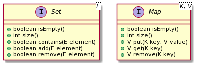
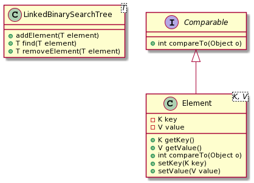

# Map and Set

## Purpose
The purpose of this lab is to implement Map and Set using an AVL tree.

## Evaluation
Students will be awarded up to 10 points for successfully completing this lab as
outlined below.

## Map and Set
A _map_ is a collection that establishes a relationship between keys and values,
providing an efficient way to retrieve a value given its key. The keys of a map
must be unique, and each key can map to only one value. Both
the keys and the values of a map can be any type of object. A map's
implementation must provide efficient lookup as it is designed to store and
retrieve mappings.

A _set_ is a collection of elements with no duplicates. The primary purpose of
a set is to determine whether a particular element is a member of the set.
Therefore, like that of a map, a set's implementation must be efficient when
searching for an element.

The Java API defines interfaces called [Map](https://docs.oracle.com/javase/8/docs/api/java/util/Map.html) and [Set](https://docs.oracle.com/javase/7/docs/api/java/util/Set.html) to define the public interaction available for these types of collections.
We will implement simplified versions of such interfaces as shown in the
following UML digram.



As for the underlying implementation strategies, we can use our implementation
of the AVL tree. Our AVL tree is a balanced binary search tree, which provides
efficient (`O(n)`) lookup, but it stores objects of a generic type and use the
natural ordering to store and retrieve the objects. In order to implement the
Map interface, we need to store "mappings" (key and value pairs) and sort them
by the key values. To solve this problem, we can create an `Element` class to
encapsulate a key-value pair as a single object and make it `Comparable` by
comparing the keys as shown in the code below.
```java
public class Element<K,V> implements Comparable{
  private K key;
  private V value;

  public Element(K key, V value){
    this.key = key;
    this.value = value;
  }

  public int compareTo(Object obj){
    Element e = (Element)obj;
    Comparable comparableKey = (Comparable)key;
    return comparableKey.compareTo(e.key);
  }

  public K getKey(){
    return key;
  }

  public V getValue(){
    return value;
  }

  public String toString(){
    return ""+key+"->"+value;
  }
}
```

Now, we can add `Element` objects in the AVL tree and retrieve them by keys.

## Implement Map
First, we will define a `TreeMap` by implementing a simplified Map interface
and using a AVL tree implementation as the underlying storage. The AVL tree
implementation is provided in `tree.jar`. We will use the `addElement`, `find`,
and `removeElement` methods in the AVL tree to implement the `get`, `put`, and `remove`
method in the `TreeMap`. The following diagram shows the signatures of the
essential methods:



Your can compile and run the `TreeMapTester` to test your solution.
```
javac -cp tree.jar:. *.java
java -cp tree.jar:. TreeMapTester
```

## Implement Set
Next, we will implement `TreeSet` in terms of `TreeMap` because if we keep
tracks of mappings (key-value pairs) we will definitely know whether a key
exists or not.

Your can compile and run the `TreeSetTester` to test your solution.
```
javac -cp tree.jar:. *.java
java -cp tree.jar:. TreeSetTester
```

## Just for fun
How would you find out whether certain words appear in the book "Adventures of Huckleberry Finn". The `WordTest` class solves the problem by using a `TreeSet`.
It reads adds all the words from `huckleberry.txt` and uses `contains()` to test whether a word
appears in the set. If you `TreeSet` works, the `WordTest` class should pass all
the tests.

Please study the code to understand how it works. The `TreeSet`, which uses a
`TreeMap`, which uses a `AVL` tree, can handle `14,484` words easily, which is
pretty cool.

| word         | exists? |
|--------------|---------|
| hell         | true    |
| gwyne        | true    |
| Shakespeare. | true    |
| plays        | false   |
| knowed       | true    |

```
java -cp tree.jar:. WordTest
Enter the name of the file containing the words: huckleberry.txt
```

## Turn in
Please add a `result.txt` file with the output of all your test cases.
